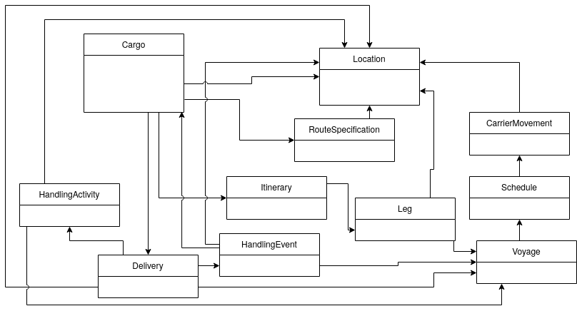

# DDDSample

This is the new home of the original DDD Sample app hosted at SourceForge. 

Our intention is to move everything from SourceForge to GitHub in due time while starting upgrading both the technical aspects as well as the DDD aspects of the DDD Sample.

This project is a joint effort by Eric Evans' company [Domain Language](https://www.domainlanguage.com/) and the [Swedish software consulting company Citerus](https://www.citerus.se/).

The application uses Spring Boot. To start it go to the root directory and type `mvn spring-boot:run` or run the `main` method of the `Application` class from your IDE.  
Then open http://localhost:8080/dddsample in your browser (and make sure that no firewall is blocking the communication and that Javascript for localhost is not blocked).

Discussion group: https://groups.google.com/forum/#!forum/dddsample

Development blog: https://citerus.github.io/dddsample-core/

Trello board: https://trello.com/b/PTDFRyxd

## Entity relationships

The diagram was created with diagrams.net (formerly draw.io).

## Using the HandlingReport REST API

The HandlingReport API has one endpoint that takes a JSON request body:

    POST /dddsample/handlingReport

You can use cURL to send the request using an JSON file for the body:

    curl --data-binary "@/path/to/project/src/test/resources/sampleHandlingReport.json" \
    -H 'Content-Type: application/json;charset=UTF-8' \
    http://localhost:8080/dddsample/handlingReport

See the [api-docs.yaml](/api-docs.yaml) file for a complete API definition.